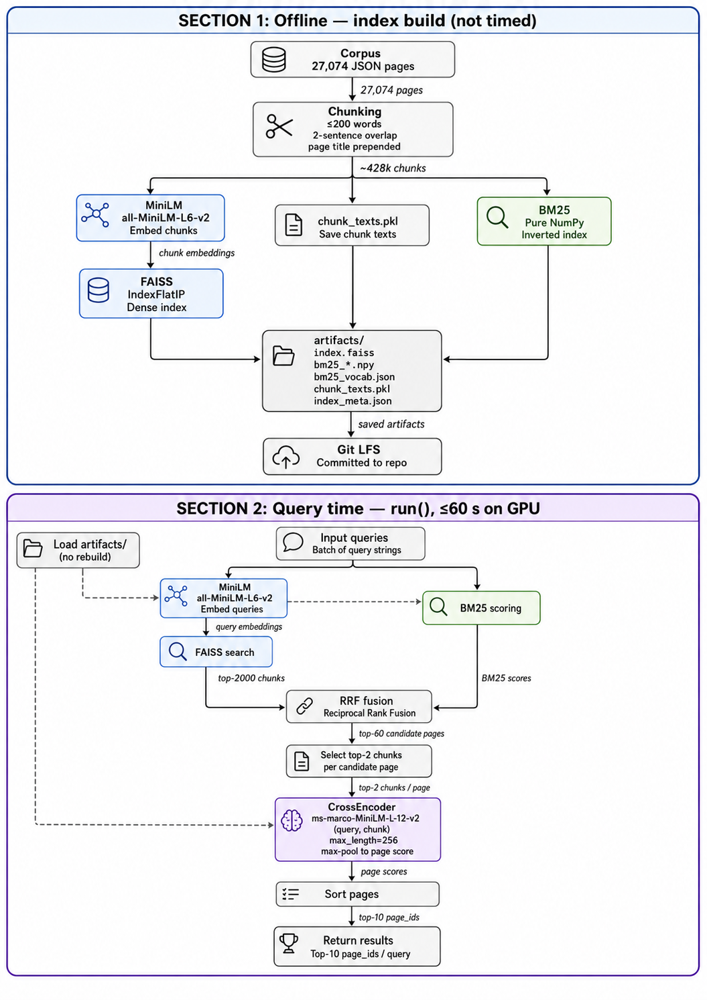

# Section B — Hybrid Retrieval Pipeline

End-to-end retrieval over a Wikipedia-style corpus. `run(queries)` returns, for each
query, a ranked list of `page_id`s (the top 10 are scored with NDCG@10).

## Team

| Name | ID |
|------|----|
| Maya Meirovich | 314689498 |
| Adi Golani | 322649229 |
| Paz Goldfryd | 318322104 |

## Project description & strategy

The task is to rank corpus pages for a batch of queries within a strict query-time budget
(≤ 60 s on the course GPU). Our strategy is a **hybrid retrieve-then-rerank** pipeline that
trades a heavy one-time offline build for a fast, accurate query phase:

1. **Sentence-aware chunking.** Pages are split into overlapping chunks (≤ 200 words,
   2-sentence overlap, page title prepended to each chunk). Chunking instead of indexing
   whole pages keeps each unit topically focused, which sharpens both retrieval and
   reranking.
2. **Two complementary first-stage retrievers.** A **dense** bi-encoder
   (MiniLM `all-MiniLM-L6-v2` + FAISS `IndexFlatIP`) captures semantic similarity, while a
   **sparse** BM25 index (pure NumPy) captures exact lexical matches. The two recall
   different relevant chunks.
3. **Reciprocal Rank Fusion (RRF).** Dense and sparse rankings are merged into a single
   candidate list, taking the top-60 candidate pages. RRF is robust because it combines
   ranks rather than raw, differently-scaled scores.
4. **Cross-encoder reranking.** A CrossEncoder (`ms-marco-MiniLM-L-12-v2`) jointly scores
   `(query, chunk)` pairs for the top-2 chunks of each candidate page and max-pools them
   into a per-page score. This is the most accurate but most expensive stage, so it runs
   only on the small fused candidate set.
5. **Top-10 page IDs** per query are returned.


## Pipeline overview



```
Offline (scripts/build_index.py — run once by us, NOT run at grading):
  corpus → sentence-aware chunking (≤200 words/chunk, 2-sentence overlap, title prefix)
         → MiniLM (all-MiniLM-L6-v2) embeddings → FAISS IndexFlatIP        [dense]
         → BM25 inverted index (pure numpy/stdlib)                          [sparse]
         → chunk_texts.pkl (chunk strings for the reranker)
         → artifacts/ (committed to the repo via Git LFS)

Query time (run(); ≤60 s on GPU):
  queries → MiniLM embed → FAISS top-2000 chunks                            [dense]
          → BM25 scoring                                                    [sparse]
          → Reciprocal Rank Fusion → top-60 candidate pages
          → CrossEncoder (ms-marco-MiniLM-L-12-v2) reranks the top-2 chunks
            per page (max-pool, max_length=256) → top-10 page_ids
```

## Setup

The pipeline needs a **CUDA-12.1-compatible NVIDIA GPU** (as on the course VM — Tesla M60,
driver 535) and **Python 3.10** (the pinned wheels target 3.10). Without a GPU the run may
exceeds the 60 s budget.

```bash
# 1. Install Git LFS (the index artifacts are stored via LFS)
git lfs install

# 2. Clone the repo (artifacts download as real files, not pointer stubs)
git clone <repo-url>
cd <repo>
# if you cloned before installing git-lfs:  git lfs pull

# 3. Create a fresh environment
python -m venv .venv
source .venv/bin/activate

# 4. Install the dependencies
pip install --upgrade pip
pip install -r requirements.txt
```

`requirements.txt` pins `torch==2.4.1+cu121` so `torch.cuda.is_available()` is `True` on
the course hardware. The MiniLM and cross-encoder weights are pretrained and loaded from
the Hugging Face hub (cached locally on first use); they are **not** stored in the repo.

## Building the index

The index build is **offline** and has **already been run by us**; the results are
committed under `artifacts/`. **There is not need to build anything to grade the project** —
`run()` loads the prebuilt artifacts at startup and never rebuilds.

The build is provided only for completeness. To regenerate `artifacts/` from the corpus in
`data/Wikipedia Entries/`:

```bash
python scripts/build_index.py
```

## Running the public evaluation (no rebuild)

With the dependencies installed and the artifacts present:

```bash
python scripts/eval_public.py
```

Prints `mean_ndcg@10` over the public queries in `data/public_queries.json`. On the course
VM (Tesla M60) the query phase runs in ~22 s.

## Artifacts

Built offline and committed via Git LFS; `run()` loads these at startup and never rebuilds.

| File | Description | Size |
|------|-------------|------|
| `artifacts/index.faiss` | FAISS `IndexFlatIP` over all chunk embeddings | ~657 MB (LFS) |
| `artifacts/chunk_texts.pkl` | All chunk strings (cross-encoder input) | ~458 MB (LFS) |
| `artifacts/bm25_postings_data.npy` | Flattened `(chunk_id, tf)` posting lists | ~302 MB (LFS) |
| `artifacts/bm25_vocab.json` | term → term_id mapping | ~5.5 MB |
| `artifacts/index_meta.json` | `page_id` per chunk row + BM25 hyper-parameters | ~4.6 MB |
| `artifacts/bm25_offsets.npy` | Per-term offsets into the posting lists | ~2.2 MB |
| `artifacts/bm25_doc_lengths.npy` | Token count per chunk | ~1.7 MB |
| `artifacts/bm25_idf.npy` | IDF per vocabulary term | ~1.1 MB |

## Repository layout

```
main.py              run(queries) entry point (+ import-time warm-up)
chunk.py             sentence-aware chunking
embed.py             MiniLM embedding wrapper
index.py             offline index build + artifact loading
retrieve.py          query-time dense + sparse + RRF + cross-encoder rerank
utils.py             shared paths / helpers
eval.py              NDCG@10 utilities (read-only)
scripts/             build_index.py, eval_public.py (read-only)
artifacts/           prebuilt index (Git LFS)
data/                corpus + public_queries.json
docs/                pipeline flow chart
```

## Presentation video

<!-- TODO: replace with the real link before submission -->
Link: **<ADD PRESENTATION VIDEO LINK HERE>**
